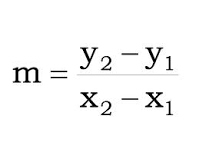

## Operadores

### OBJETIVO 

- Hacer uso de los operadores 

#### REQUISITOS 

1. Haber cursado el [Ejemplo 4](../Ejemplo-04)

#### DESARROLLO

##### 1. La ecuación de la pendiente se obtiene por la siguiente expresión:

Expresarla ahora con operadores:

##### 2. Resolver el valor de la pendiente, tomanto en cuenta que 

P1(4,3), P2(-3,-2)

##### 3. Del ejercicio anterior, responder: ¿Por qué el resultado obtenido difiere del resultado esperado?

##### 4. Encontrar una solución para que se refleje el resultado

[`Atrás`](../Ejemplo-04) | [`Siguiente`](../Readme.md)